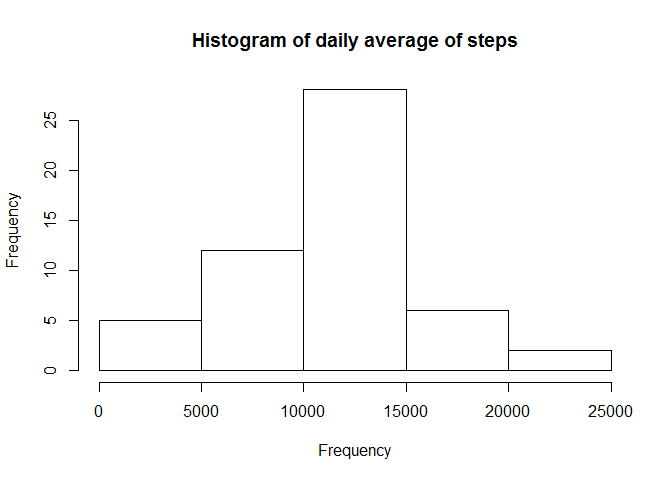
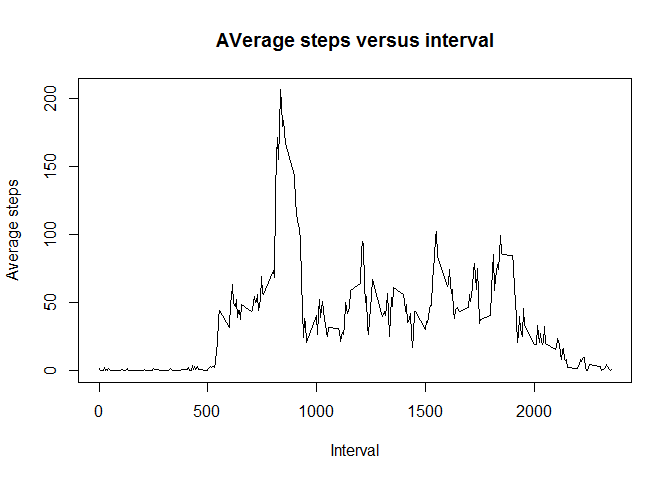
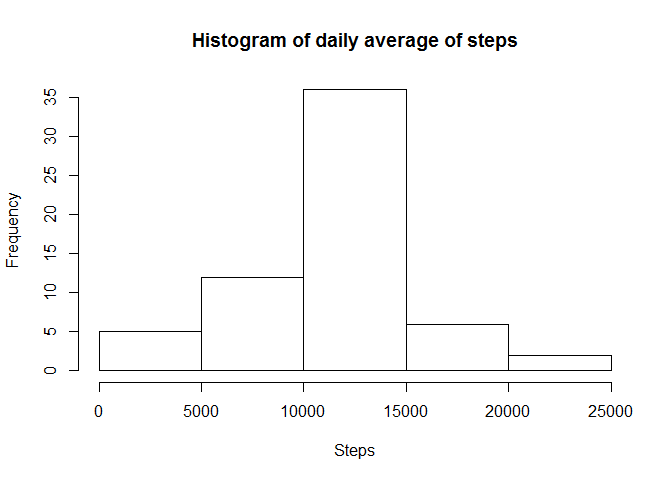
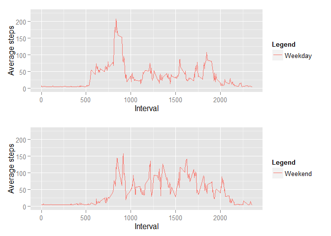

# Reproducible Research: Peer Assessment 1


## Loading and preprocessing the data

Set the working directory

```r
setwd("C:/Users/Brian/OneDrive/DataScience/ReproducibleResearch/RepData_PeerAssessment1")
```

Load the data

```r
dataRaw <- read.csv("./activity/activity.csv")
```

## What is mean total number of steps taken per day?

1. Calculate the total number of steps taken per day

```r
library(plyr)
library(dplyr)
```

```
## 
## Attaching package: 'dplyr'
## 
## The following objects are masked from 'package:plyr':
## 
##     arrange, count, desc, failwith, id, mutate, rename, summarise,
##     summarize
## 
## The following objects are masked from 'package:stats':
## 
##     filter, lag
## 
## The following objects are masked from 'package:base':
## 
##     intersect, setdiff, setequal, union
```

```r
dataDailyTotal <- ddply(dataRaw,.(date),summarize,steps=sum(steps))
```

2. Make a histogram of the total number of steps taken each day

```r
hist(dataDailyTotal$steps, main = "Histogram of daily average of steps", xlab = "Steps", ylab = "Frequency")
```

 

3. Calculate and report the mean and median of the total number of steps taken per day


```r
paste("Mean: ",mean(dataDailyTotal$steps, na.rm = TRUE))
```

```
## [1] "Mean:  10766.1886792453"
```

```r
paste("Median: ",median(dataDailyTotal$steps, na.rm = TRUE))
```

```
## [1] "Median:  10765"
```

## What is the average daily activity pattern?

1. Make a time series plot (i.e. type = "l") of the 5-minute interval (x-axis) and the average number of steps taken, averaged across all days (y-axis)


```r
dataDailyProfile = ddply(dataRaw,.(interval),summarize,stepsMean=mean(steps, na.rm = TRUE))
plot(dataDailyProfile$interval, dataDailyProfile$stepsMean, type ="l", main = "AVerage steps versus interval", xlab = "Interval", ylab = "Average steps")
```

 

2. Which 5-minute interval, on average across all the days in the dataset, contains the maximum number of steps?


```r
paste("Interval with maximum average steps:", dataDailyProfile[which.max(dataDailyProfile$stepsMean),1])
```

```
## [1] "Interval with maximum average steps: 835"
```


## Imputing missing values

1. Calculate and report the total number of missing values in the dataset (i.e. the total number of rows with NAs)


```r
paste("The table has ", nrow(dataRaw[is.na(dataRaw$steps),]), "rows with NA")
```

```
## [1] "The table has  2304 rows with NA"
```

2. Devise a strategy for filling in all of the missing values in the dataset. The strategy does not need to be sophisticated. For example, you could use the mean/median for that day, or the mean for that 5-minute interval, etc.

To avoid skewing the daily profile, I'll use the average of the 5 minute intervals.

3. Create a new dataset that is equal to the original dataset but with the missing data filled in.


```r
idx <- is.na(dataRaw$steps)
dataClean <- dataRaw
dataClean[idx,1] <- mean(dataDailyProfile$stepsMean)
```

4. Make a histogram of the total number of steps taken each day and Calculate and report the mean and median total number of steps taken per day. Do these values differ from the estimates from the first part of the assignment? What is the impact of imputing missing data on the estimates of the total daily number of steps?


```r
dataDailyTotalClean <- ddply(dataClean,.(date),summarize,steps=sum(steps))
hist(dataDailyTotalClean$steps, main = "Histogram of daily average of steps", xlab = "Steps", ylab = "Frequency")
```

 

```r
paste("Mean: ",mean(dataDailyTotalClean$steps, na.rm = TRUE))
```

```
## [1] "Mean:  10766.1886792453"
```

```r
paste("Median: ",median(dataDailyTotalClean$steps, na.rm = TRUE))
```

```
## [1] "Median:  10766.1886792453"
```

Imputing the data did seem to change the histogram, the data is more tightly clustered between 10,000 and 15,000 steps. Since I replaced the NA's with averages it did not change the mean or median significanly.


## Are there differences in activity patterns between weekdays and weekends?

1. Create a new factor variable in the dataset with two levels - "weekday" and "weekend" indicating whether a given date is a weekday or weekend day.


```r
dataClean$day <- weekdays(as.Date(dataClean$date))
dataClean$day <- gsub("Monday","Weekday",dataClean$day)
dataClean$day <- gsub("Tuesday","Weekday",dataClean$day)
dataClean$day <- gsub("Wednesday","Weekday",dataClean$day)
dataClean$day <- gsub("Thursday","Weekday",dataClean$day)
dataClean$day <- gsub("Friday","Weekday",dataClean$day)
dataClean$day <- gsub("Saturday","Weekend",dataClean$day)
dataClean$day <- gsub("Sunday","Weekend",dataClean$day)
dataClean$dayFactor <- factor(dataClean$day)
```

2. Make a panel plot containing a time series plot (i.e. type = "l") of the 5-minute interval (x-axis) and the average number of steps taken, averaged across all weekday days or weekend days (y-axis). See the README file in the GitHub repository to see an example of what this plot should look like using simulated data.


```r
dataCleanWeekday <- dataClean[as.numeric(dataClean$dayFactor)==1,]
dataCleanWeekend <- dataClean[as.numeric(dataClean$dayFactor)==2,]
dataDailyProfileWeekday <- ddply(dataCleanWeekday,.(interval),summarize,stepsMean=mean(steps, na.rm = TRUE))
dataDailyProfileWeekend <- ddply(dataCleanWeekend,.(interval),summarize,stepsMean=mean(steps, na.rm = TRUE))

library(ggplot2)

p1 <- ggplot() + geom_line(data = dataDailyProfileWeekday, aes(x = interval, y = stepsMean, color = "Weekday")) 
p1 <- p1 + xlab('Interval')
p1 <- p1 + ylab('Average steps')
p1 <- p1 + ylim(0,225)
p1 <- p1 + labs(color="Legend")


p2 <- ggplot() + geom_line(data = dataDailyProfileWeekend, aes(x = interval, y = stepsMean, color = "Weekend")) 
p2 <- p2 + xlab('Interval')
p2 <- p2 + ylab('Average steps')
p2 <- p2 + ylim(0,225)
p2 <- p2 + labs(color="Legend")

library(gridExtra)
print(grid.arrange(p1, p2, nrow=2))
```

 

```
## TableGrob (2 x 1) "arrange": 2 grobs
##   z     cells    name           grob
## 1 1 (1-1,1-1) arrange gtable[layout]
## 2 2 (2-2,1-1) arrange gtable[layout]
```


