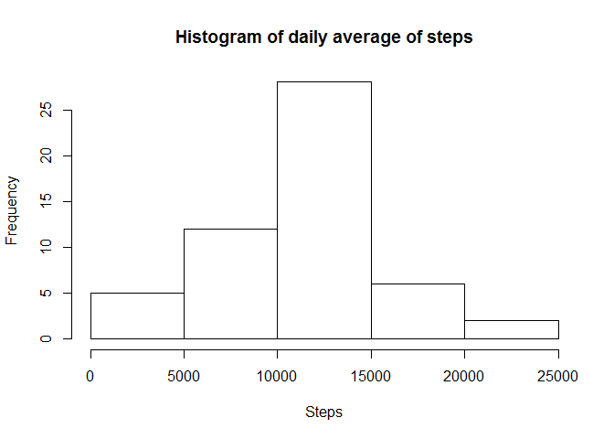

# Reproducible Research: Peer Assessment 1


## Loading and preprocessing the data

Set the working directory

```r
setwd("C:/Users/Brian/OneDrive/DataScience/ReproducibleResearch/RepData_PeerAssessment1")
```

Load the data

```r
dataRaw <- read.csv("./activity/activity.csv")
```

## What is mean total number of steps taken per day?

1. Calculate the total number of steps taken per day

```r
library(plyr)
library(dplyr)
```

```
## 
## Attaching package: 'dplyr'
## 
## The following objects are masked from 'package:plyr':
## 
##     arrange, count, desc, failwith, id, mutate, rename, summarise,
##     summarize
## 
## The following objects are masked from 'package:stats':
## 
##     filter, lag
## 
## The following objects are masked from 'package:base':
## 
##     intersect, setdiff, setequal, union
```

```r
dataDailyTotal <- ddply(dataRaw,.(date),summarize,steps=sum(steps))
```

2. Make a histogram of the total number of steps taken each day

```r
hist(dataDailyTotal$steps, main = "Histogram of daily average of steps", xlab = "Frequency", ylab = "Frequency")
```

 

3. Calculate and report the mean and median of the total number of steps taken per day


```r
paste("Mean: ",mean(dataDailyTotal$steps, na.rm = TRUE))
```

```
## [1] "Mean:  10766.1886792453"
```

```r
paste("Median: ",median(dataDailyTotal$steps, na.rm = TRUE))
```

```
## [1] "Median:  10765"
```

## What is the average daily activity pattern?


## Imputing missing values


## Are there differences in activity patterns between weekdays and weekends?
